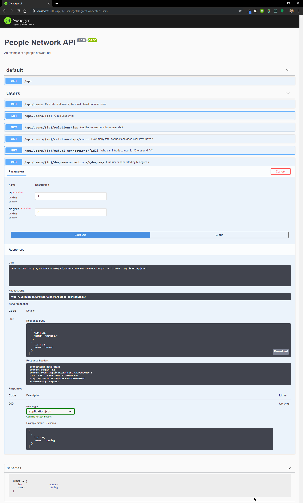
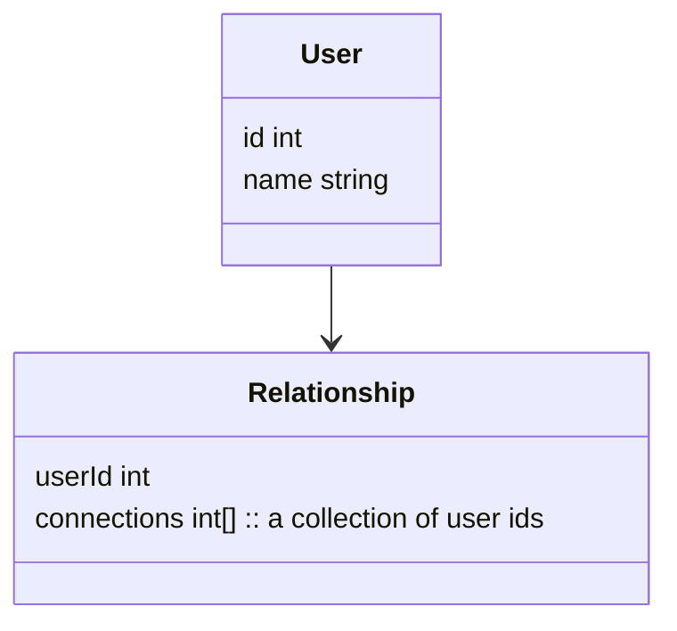

# People Network API

[](https://travis-ci.com/alexbuczynsky/people-network-api)


## Installation

> Note: you will need node.js installed on your machine.

```bash
$ npm install
```

## Running the app


> Note: The app will run at http://localhost:3000/api

```bash
$ npm run start
```

## Test

```bash
$ npm run test
```

## Recommended API Exploration
The api has a swagger api located at http://localhost:3000/api

The easiest way to navigate and test the api is to open this interface and try it out.

Here is a screenshot preview of what this view looks like:



## Original Prompt

> Background: We are trying build an API that answers questions about a network of people.

There are two data sets attached to the email. First file contains list of 100 people and their names. Second file has the relationship of each person with at least 5 other folks on the list.
 

**Requirements:**
- Create an API Server with the following functionality
  - [x] Get a user by `id`
  - [x] Get the connections from user `id=X`
  - [x] How many total connections  does user `id=X `has?
  - [x] Who can introduce user `id=X` to user `id=Y`?
  - [x] Which connections are common between user `id=X` and user `id=Y`?
    - Note: This is the same requirement as the previous requirement.
  - [x] Which user has the most connections?
  - [x] Which user has the least connections?
- The APIs should accept “degree” as a parameter
  - [x] `1st-degree connections` - People you're directly connected.
  - [x] `2nd-degree connections` - People who are connected to your 1st-degree connections.
  - [x] `3rd-degree connections` - People who are connected to your 2nd-degree connections
  - [x] `Nth-degree connections` – People who are connected to your (n-1)th-degree connections
 

You are free to use any language and technology in your solution.

## Models



## Routes

| Method | Route                                       | Description                                                                                               |
| ------ | ------------------------------------------- | --------------------------------------------------------------------------------------------------------- |
| GET    | /api                                        | Swagger documentation is hosted here                                                                      |
| GET    | /api/users                                  | Returns all users and optionally the most / least popular                                                 |
| GET    | /api/users?popularity=most                  | Returns the most popular user. It will return more than one user if they have the same number of friends  |
| GET    | /api/users?popularity=least                 | Returns the least popular user. It will return more than one user if they have the same number of friends |
| GET    | /api/users                                  | Returns all users and optionally the most / least popular                                                 |
| GET    | /api/users/{id}                             | Returns a user by id                                                                                      |
| GET    | /api/users/{id}/relationships               | Returns the users the target user knows                                                                   |
| GET    | /api/users/{id}/relationships/count         | Returns the number of users the target user knows                                                         |
| GET    | /api/users/{id}/mutual-connections/{id2}    | Returns the users both user 1 and user 2 know                                                             |
| GET    | /api/users/{id}/degree-connections/{degree} | Returns the users seperated from user {id} by degree N                                                    |
